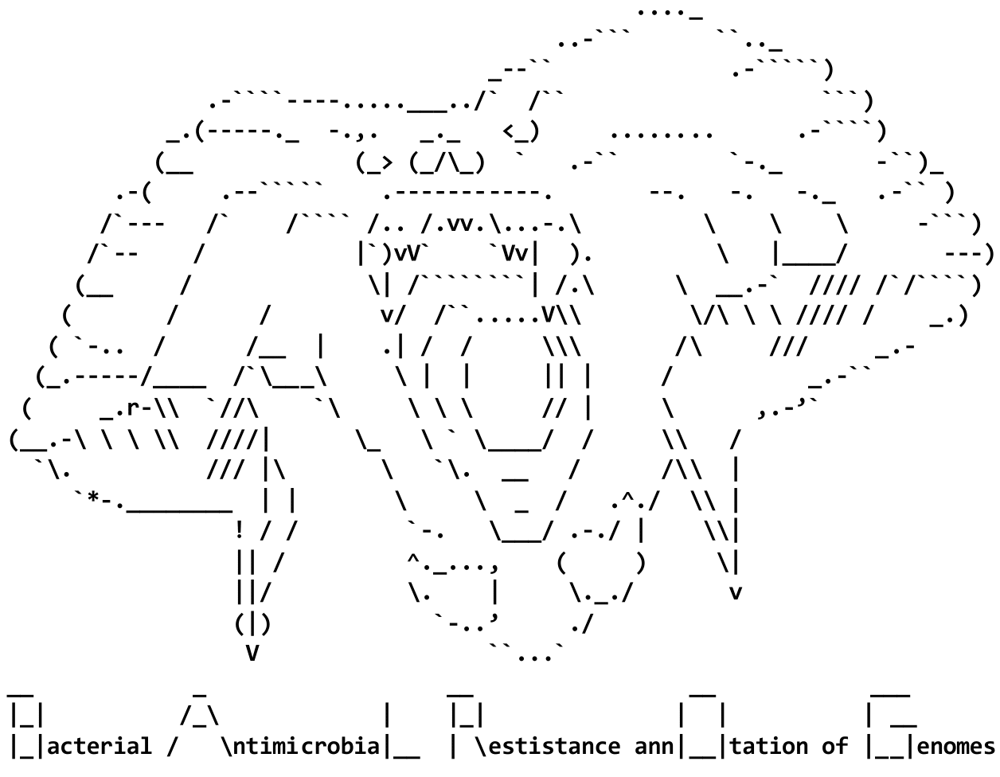

<a name="readme-top"></a>

<!-- PROJECT SHIELDS -->
[![Contributors][contributors-shield]][contributors-url]
[![Forks][forks-shield]][forks-url]
[![Stargazers][stars-shield]][stars-url]
[![Issues][issues-shield]][issues-url]
[![MIT License][license-shield]][license-url]
<!--[![MIT License][(https://img.shields.io/badge/style-flat--squared-green.svg?style=flat-square)]][license-url]-->
[](https://www.nextflow.io/)
[](https://www.docker.com/)
[](https://sylabs.io/docs/)
[](https://zenodo.org/doi/10.5281/zenodo.11110897)
<!-- [![LinkedIn][linkedin-shield]][linkedin-url] -->

<!-- PROJECT LOGO -->
<br />

<h3 align="center">BALROG-MON</h3>
  <p align="center">
    Bacterial Antimicrobial Resistance annOtation of Genomes - Metagenomic Oxford Nanopore

  <p align="center">
    <a href="https://github.com/edwardbirdlab/HT-BALRROG/issues/new?labels=bug&template=bug-report---.md">Report Bug</a>
    ·
    <a href="https://github.com/edwardbirdlab/HT-BALRROG/issues/new?labels=enhancement&template=feature-request---.md">Request Feature</a>
  </p>
</div>

<!-- Workflow Overview -->

<picture>
  <!-- Dark mode image -->
  <source media="(prefers-color-scheme: dark)" srcset="images/balrog_nobackground_darkmode.png"> 
  <!-- Light mode image -->
  <source media="(prefers-color-scheme: light)" srcset="images/balrog_lightmode.png">
  <!-- Fallback image -->
  
</picture>

<!-- ABOUT THE PROJECT -->


## About BALROG-MON

<!-- [![Product Name Screen Shot][product-screenshot]](https://example.com) -->

BALROG-MON (Bacterial Antimicrobial Resistance annOtation of Genomes - Metagenomic Oxford Nanopore) is a comprehensive high throughput Nextflow pipeline built to utilize Q20+ Oxford Nanopore long-reads for the investigation of bacterial antimicrobial resistance (AMR) and its mobility from metagenomic samples. While AMR characterization is the main goal of BALROG-MON, it also provides subworkflows for many related analyses customizable to users' needs, such as assembly-free annotation, pathogen detection, and metagenomic community analysis of bacteria, viruses, and other microorganisms in samples. 

> [!NOTE]
> Updates to BALROG-MON may occur periodically to help continually improve the pipeline. If you have any requests or recommended changes you'd like to see (i.e. usage with other data types), please reach out via email (edwardbirdlab@gmail.com | edwardbird@ksu.edu) or <a href="https://github.com/edwardbirdlab/HT-BALRROG/issues/new?labels=enhancement&template=feature-request---.md">request feature</a>.
> <br />
><br />
> If you experience any trouble or find bugs when running BALROG-MON, please <a href="https://github.com/edwardbirdlab/HT-BALRROG/issues/new?labels=bug&template=bug-report---.md">report issues or bugs</a> and they will be addressed as soon as possible.

<h3 align="center">Not the BALROG pipeline you're looking for?</h3>
 <p align="center">
   <a href="https://github.com/edwardbirdlab/HT-BALRROG/issues/new?labels=bug&template=bug-report---.md">BALROG-MSR: Bacterial Antimicrobial Resistance annOtation of Genomes - Metagenomic Short Read</a>
   <br />
   <a href="https://github.com/edwardbirdlab/HT-BALRROG/issues/new?labels=bug&template=bug-report---.md">BALROG-ISO: Bacterial Antimicrobial Resistance annOtation of Genomes - ISOlate whole genomes</a>

## Workflow Overview

<picture>

  <source media="(prefers-color-scheme: dark)" srcset="images/pipeline_outline_darkmode.png"> 
  <source media="(prefers-color-scheme: light)" srcset="images/balrog_workflow_light.png">
  
</picture>

*See sections below for details on subworkflows (SW)

<!--
<p align="right">(<a href="#readme-top">back to top</a>)</p>
-->

<!-- TABLE OF CONTENTS -->
## Table of Contents
- <a href="#readme-getting-started">Getting Started</a>
- <a href="#readme-running-balrog">Running BALROG-MON</a>
- <a href="#readme-core-steps">Core Steps of Workflow</a>
- <a href="#readme-optional-steps">Optional Steps of Workflow</a>
- <a href="#readme-citations">Citations</a>
- <a href="#readme-license">License</a>
- <a href="#readme-contact">Contact Information</a>
<p align="right">(<a href="#readme-top">back to top</a>)</p>

<a name="readme-getting-started"></a>
<!-- GETTING STARTED -->
## Getting Started

Before you get too far along, familiarize yourself with this section to make sure this is the pipeline for you and your equipment and samples can meet the requirements. (Don't worry, there isn't too much to do).

### 1. What Data Do I Need?

BALROG-MON in its current form expects Q20+ Oxford Nanopore Long Read Metagenomic Sequencing. BALROG-MON can run in "Assembly-Free" mode or assembles a metagenome using metaFlye, allowing for the analysis of low and high coverage metagenomes. BALROG-MON in its standard configuration will require 100GB of RAM.
<br />
<br />
> [!NOTE]
>**If you would like to run BALROG-MON with older, non-Q20+ Nanopore data, feel free to <a href="https://github.com/edwardbirdlab/HT-BALRROG/issues/new?labels=enhancement&template=feature-request---.md">request feature</a>.**

### 2. Dependencies

All dependencies are managed via Docker Containers and hosted on DockerHub. One of the following container runtime software packages will be required:
<br />
- Nextflow (>= 23.04.0.5857) - [Install Nextflow](https://www.nextflow.io/docs/latest/install.html)
- Docker/Singularity/Apptainer - [Install Docker](https://docs.docker.com/engine/install/) - [Install Singularity](https://docs.sylabs.io/guides/3.0/user-guide/installation.html) - [Install Apptainer](https://apptainer.org/docs/admin/main/installation.html)

### 3. Installation

Preferred Method - Download Release
   ```sh
   wget https://github.com/edwardbirdlab/BALROG-MON/releases/download/v0.0.0/BALROG-0.0.0.tar.gz
   tar -xzf BALROG-0.0.0.tar.gz
   ```
Method 2 - Clone Repo
   ```sh
   git clone https://github.com/edwardbirdlab/BALROG-MON
   ```

### 4. Creating a Sample Sheet

BALROG-MON takes a CSV (Comma-Seperated-Value) sheet as the input. Note that the "sample" column will be the prefix of all output files for that sample. 
<br />
<br />
Example Format:
```
sample,path,reference_genome
Sample_Name_1,/absolute/path/to/sample1.fastq.gz,/absolute/path/to/reference_genome_1.fna
Sample_Name_2,/absolute/path/to/sample2.fastq.gz,/absolute/path/to/reference_genome_1.fna
```

### 5. Nextflow Configuration

When creating a Nextflow config, ensure a container runtime is enabled (Singularity/Apptainer/Docker). If you are using Slurm, you can use the incuded Beocat Slurm config as a template. Most nf-core configs will also be supported. If you have never created a Nextflow config, or are having issues, reach out to your local administration.
<br />
[Nextflow Configuration](https://www.nextflow.io/docs/latest/config.html) - [nf-core configs](https://nf-co.re/configs)


### 6. Pipeline Configuration

If you want to change any parameters of BALROG-MON from its default options, they can be changed using the "nextflow.config" file. Configurable parameters will be outlined in the detailed sections below, as well as in the config file.

<p align="right">(<a href="#readme-top">back to top</a>)</p>

<a name="readme-running-balrog"></a>
<!-- RUNNING BALROG-MON -->
## Running BALROG-MON

1. Running the whole pipeline
```sh
nextflow run /path/to/edwardbirdlab/BALROG-MON -c /path/to/config.cfg
```
2. Generate Multi-QC
```sh 
nextflow run /path/to/edwardbirdlab/BALROG-MON -c /path/to/config.cfg --workflow-opt multiqc
```
<p align="right">(<a href="#readme-top">back to top</a>)</p>

<a name="readme-core-steps"></a>
<!-- CORE STEPS OF WORKFLOW -->
## Core Steps of Workflow

### 1. Preprocessing

_**Trimming & Raw QC**_

- [FastQC](https://github.com/s-andrews/FastQC) : Raw Read
- [Porechop](https://github.com/rrwick/Porechop)
- [chopper](https://github.com/wdecoster/chopper)
    <br />
    _Parameters_
    - params.chopper_minlen = (defualt = 500)
  
    - params.chopper_averagequality = (defualt = 20)
- [FastQC](https://github.com/s-andrews/FastQC) : Trimmed Read

_**Final Read QC**_

- [MultiQC](https://github.com/MultiQC/MultiQC)

### 2. Read-Based Identification

_**Pathogen Detection (Core Step for "Assembly Free" Only)**_

- [Kraken 2](https://github.com/DerrickWood/kraken2) (standard database)

### 3. Sequence Processing

_**Assembly**_

- "Assembly Free"
    <br />
    - [Seqtk](https://github.com/lh3/seqtk) : Convert fastq to fasta
  
  **OR**
    <br />
- "Assembled"
    <br />
    - [metaFlye](https://github.com/mikolmogorov/Flye) : Metagenomic assembly

    - [Kraken 2](https://github.com/DerrickWood/kraken2) (standard database) : Reassign sequence identities 

_**Sequence Processing QC**_

- [QUAST](https://github.com/ablab/quast)

### 4. ARG & Mobility Annotation

- [Plasmer](https://github.com/nekokoe/Plasmer) : Plasmid prediction
    <br />
    _Parameters_
    - params.plasmer_min_len = (defualt = 500)
       
    - params.plasmer_max_len = (defualt = 500000)
   
- [CARD](https://card.mcmaster.ca/) 

### 5. Binning

- [LRBinner](https://github.com/anuradhawick/LRBinner)
- [CheckM](https://github.com/Ecogenomics/CheckM)
<p align="right">(<a href="#readme-top">back to top</a>)</p>

<a name="readme-optional-steps"></a>
<!-- OPTIONAL STEPS OF WORKFLOW -->
## Optional Steps of Workflow

### 1. Preprocessing

_**Standardize Read Names**_

- Included Python script (useful if you have long read names)

_**Remove Human DNA**_

- [minimap2](https://github.com/lh3/minimap2) : Mapping to human genome
- [SAMtools](https://github.com/samtools/samtools) : Extracting non-human reads names
- [Seqtk](https://github.com/lh3/seqtk) : Extract non-human reads 

_**Remove Host DNA**_

- [minimap2](https://github.com/lh3/minimap2) : Mapping to host genome
- [SAMtools](https://github.com/samtools/samtools) : Extracting non-host reads names
- [Seqtk](https://github.com/lh3/seqtk) : Extract non-host reads 

### 2. Read-Based Identification

_**Pathogen Detection (Optional for "Assembled" Only)**_
- [Kraken 2](https://github.com/DerrickWood/kraken2) (standard database)
  <br />
  _Parameters_
  - report-minimizer-data

  - minimum-hit-groups 3
   
_**Community Analysis**_
> [!NOTE]
> BALROG-MON does not create a graphical summary of pathogen detection and community analysis results. However, results are readily compatible for visualization using [Pavian](https://github.com/fbreitwieser/pavian).

- [Kraken 2](https://github.com/DerrickWood/kraken2) (standard database)
- [Bracken](https://github.com/jenniferlu717/Bracken)
   
### 4. ARG and Mobility Annotation

_**Multi AMR Annotation**_
> [!NOTE]
> CARD is run by defualt, however it can be switched to include additional ARG databases by setting params.cardonly = TRUE

- [CARD](https://card.mcmaster.ca/)
- [AMRFinder Plus](https://github.com/ncbi/amr?tab=readme-ov-file)
- [Resfinder](https://github.com/cadms/resfinder)
<p align="right">(<a href="#readme-top">back to top</a>)</p>

<a name="readme-citations"></a>
<!-- CITATIONS -->
## Citations

As there is currently no paper associated with BALROG-MON, please cite this Github page. Also, I feel free to contact me (edwardbirdlab@gmail.com | edwardbird@ksu.edu) to let me know!

Many tools are used in this pipeline and its respective options. See 'CITATION.md' for the list of all tools used in this pipeline.

<!-- ROADMAP 
## Roadmap

- [ ] Feature 1
- [ ] Feature 2
- [ ] Feature 3
    - [ ] Nested Feature

See the [open issues](https://github.com/edwardbirdlab/HT-BALRROG/issues) for a full list of proposed features (and known issues).

<p align="right">(<a href="#readme-top">back to top</a>)</p>


-->
<p align="right">(<a href="#readme-top">back to top</a>)</p>

<a name="readme-license"></a>
<!-- LICENSE -->
## License

Distributed for the [USDA ARS](https://www.ars.usda.gov/) under the Public Domain. See `LICENSE` for more information.


<p align="right">(<a href="#readme-top">back to top</a>)</p>

<a name="readme-contact"></a>
<!-- CONTACT -->
## Contact

Edward Bird -  - edwardbirdlab@gmail.com  |  edwardbird@ksu.edu

<p align="right">(<a href="#readme-top">back to top</a>)</p>

<!-- MARKDOWN LINKS & IMAGES -->
<!-- https://www.markdownguide.org/basic-syntax/#reference-style-links -->
[contributors-shield]: https://img.shields.io/github/contributors/edwardbirdlab/HT-BALRROG.svg?style=for-the-badge
[contributors-url]: https://github.com/edwardbirdlab/HT-BALRROG/graphs/contributors
[forks-shield]: https://img.shields.io/github/forks/edwardbirdlab/HT-BALRROG.svg?style=for-the-badge
[forks-url]: https://github.com/edwardbirdlab/HT-BALRROG/network/members
[stars-shield]: https://img.shields.io/github/stars/edwardbirdlab/HT-BALRROG.svg?style=for-the-badge
[stars-url]: https://github.com/edwardbirdlab/HT-BALRROG/stargazers
[issues-shield]: https://img.shields.io/github/issues/edwardbirdlab/HT-BALRROG.svg?style=for-the-badge
[issues-url]: https://github.com/edwardbirdlab/HT-BALRROG/issues
[license-shield]: https://img.shields.io/github/license/edwardbirdlab/HT-BALRROG.svg?style=for-the-badge
[license-url]: https://github.com/edwardbirdlab/HT-BALRROG/blob/master/LICENSE
[linkedin-shield]: https://img.shields.io/badge/-LinkedIn-black.svg?style=for-the-badge&logo=linkedin&colorB=555
[linkedin-url]: https://linkedin.com/in/linkedin_username
[Nextflow-url]: https://nextflow.io
[nextflow.io]: https://github.com/nextflow-io/nextflow/workflows/Nextflow%20CI/badge.svg
