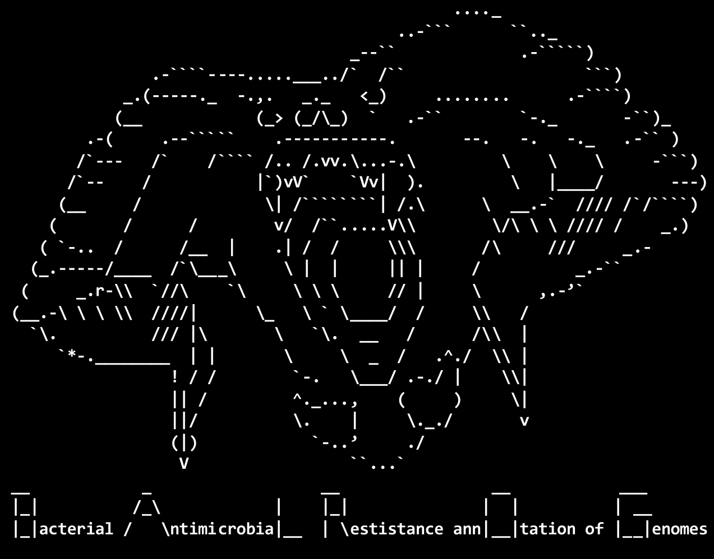
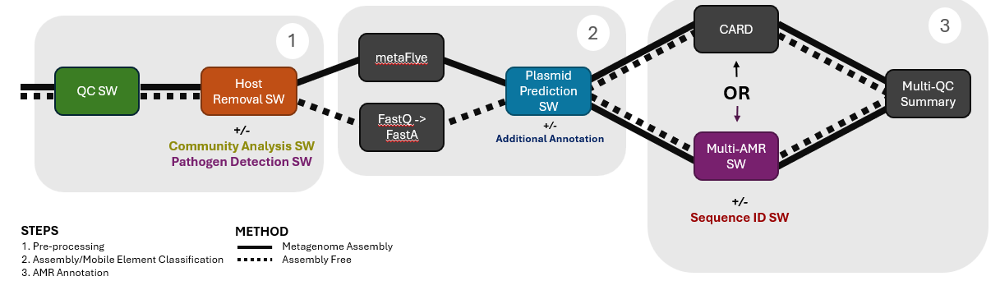

<a name="readme-top"></a>

<!-- PROJECT SHIELDS -->
[![Contributors][contributors-shield]][contributors-url]
[![Forks][forks-shield]][forks-url]
[![Stargazers][stars-shield]][stars-url]
[![Issues][issues-shield]][issues-url]
[![MIT License][license-shield]][license-url]
<!-- [![LinkedIn][linkedin-shield]][linkedin-url] -->

<!-- PROJECT LOGO -->
<br />

<h3 align="center">BALROG-MON</h3>

  <p align="center">
    Bacterial Antimicrobial Resistance annOtation of Genomes - Metagenomic Oxford Nanopore
    <br />
    ***** Still Under Development *****
    <br />
    <br />
    <a href="https://github.com/edwardbirdlab/HT-BALRROG/issues/new?labels=bug&template=bug-report---.md">Report Bug</a>
    ·
    <a href="https://github.com/edwardbirdlab/HT-BALRROG/issues/new?labels=enhancement&template=feature-request---.md">Request Feature</a>
  </p>
</div>

<!-- Workflow Overview -->

<picture>
  <!-- Dark mode image -->
  <source media="(prefers-color-scheme: dark)" srcset="images/balrog_darkmode.png"> 
  <!-- Light mode image -->
  <source media="(prefers-color-scheme: light)" srcset="images/balrog_lightmode.png">
  <!-- Fallback image -->
  
</picture>


## Workflow Overview

<picture>

  <source media="(prefers-color-scheme: dark)" srcset="images/balrog_workflow_light.png"> 
  <source media="(prefers-color-scheme: light)" srcset="images/balrog_workflow_light.png">
  
</picture>

*see below sections for in-depth subworkflows

<br />

<!--
<p align="right">(<a href="#readme-top">back to top</a>)</p>
-->

<!-- TABLE OF CONTENTS -->
<details>
  <summary>Table of Contents</summary>
  <ol>
    <li>
      <a href="#about-balrog">About BALROG</a>
    </li>
    <li>
      <a href="#getting-started">Getting Started</a>
      <ul>
        <li><a href="#what-data-do-i-need">What Data do I Need?</a></li>
        <li><a href="#dependicies">Dependicies</a></li>
        <li><a href="#installation">Installation</a></li>
        <li><a href="#creating-a-samplesheet">Creating Sample Sheets</a></li>
        <li><a href="#nextflow-configuration">Nextflow Configuration</a></li>
        <li><a href="#pipeline-configuration">Pipeline Configuration</a></li>
      </ul>
    </li>
    <li>
      <a href="#running-balrog">Running Balrog</a>
    </li>
    <li>
      <a href="#core-steps">Core Steps</a>
      <ul>
        <li><a href="#preprocessing">Preprocessing</a></li>
        <li><a href="#host-removal">Host Removal</a></li>
        <li><a href="#assembly-and-plasmid-prediction">Assembly and Plasmid Prediction</a></li>
        <li><a href="#multi-amr-annotation">Multi AMR Annotation</a></li>
      </ul>
    </li>
    <li>
      <a href="#optional-steps">Optional Steps</a>
      <ul>
        <li><a href="#community-analysis">Community Analysis</a></li>
        <li><a href="#pathogen-detection">Pathogen Detection</a></li>
        <li><a href="#additional-mobile-element-annotation">Additional Mobile Element Annotation</a></li>
        <li><a href="#additional-sequence-identification">Additional Sequence Identification</a></li>
      </ul>
    </li>
    <li><a href="#contact">Contact Information</a></li>
    <li><a href="#how-to-cite-balrog">How to Cite BALROG</a></li>
    <li><a href="#citing-tools-used-in-balrog">Citing Tools used in BALROG</a></li>
  </ol>
</details>

<br />

<!-- ABOUT THE PROJECT -->


## About BALROG

<!-- [![Product Name Screen Shot][product-screenshot]](https://example.com) -->

BALROG is a nextflow pipeline built to utilize Q20+ Oxford Nanopore Long-reads to investigate antimicrobial resistance (AMR) and its mobility from metagenomic samples. While looking at AMR
is the main goal of BALROG, it also provides subworkflows for many related analysies, such as pathogen detection and metagenomic community analysis. 


## BALROG IS STILL IN DEVELOPMENT

Not all features are fully implemented, and while the pipeline MIGHT work in its current state, I would fully expect some troubleshooting to be in store. If you do deciede to test it out in its current state
please repot any and all bugs you find, or any suggestions for improvements!


<!-- GETTING STARTED -->
## Getting Started

Before you get too far along, familiarize youself with the section to make sure this is the pipeline for you, and that you can meet the requirements. (Don't worry, there isnt too much to do)

### What Data do I Need?

BALROG in its current form expects Q20+ Oxford Nanopore Long Read Metagenomic Sequecning. BALROG can run in Assembly-Free mode or assembles a metagenome using MetaFLYE, allowing for the analysis of low and high coverage metagenomes. BALROG in its standard configuration
 will require 100GB of RAM.
<br />
<br />
**If you would like to run BALROG with older, non-Q20+ Nanopore data, feel free to submit a feature request and I will add the option.**

### Dependicies

All Dependicies are mannaged via Docker Containers and hosted on DockerHub. One of the following container runtime software packages will be required.
<br />
1. Nextflow (>= 23.04.0.5857) - [Install Nextflow](https://www.nextflow.io/docs/latest/install.html)
2. Docker/Singularity/Apptainer - [Install Docker](https://docs.docker.com/engine/install/) - [Install Singularity](https://docs.sylabs.io/guides/3.0/user-guide/installation.html) - [Install Apptainer](https://apptainer.org/docs/admin/main/installation.html)

### Installation

Perfered Method - Download Release
   ```sh
   wget https://github.com/edwardbirdlab/BALROG-MON/releases/download/v0.0.0/BALROG-0.0.0.tar.gz
   tar -xzf BALROG-0.0.0.tar.gz
   ```
Method 2 - Clone Repo
   ```sh
   git clone https://github.com/edwardbirdlab/BALROG-MON
   ```

### Creating a SampleSheet

BALROG takes a CSV (Comma-Seperted-Value) sheet as the input. Sample comlumn will be the prefix for all output files for that sample. 
<br />
Example Format:
```
sample,path,refernce_genome
Sample_Name_1,/absolute/path/to/sample1.fastq.gz,/absolute/path/to/reference_genome_1.fna
Sample_Name_2,/absolute/path/to/sample2.fastq.gz,/absolute/path/to/reference_genome_1.fna
```

### Nextflow Configuration

When crating a nextfconfig ensure a container runtime is enabled (Singularity/Apptainer/Docker). If you are using slurm, you can use the incuded Beocat slurm config as a template. Most nf-core configs will also be supported. If you have never crated a nextflow config, or are having issues reach out to your local administraction.
<br />
[Nextflow Configuration](https://www.nextflow.io/docs/latest/config.html) - [nf-core configs](https://nf-co.re/configs)


### Pipeline Configuration

If you want to change any parameters from defualt they can be changed using the defualt_params.nf file. Configurable paramaters will be outlied in the detail sections below.

<p align="right">(<a href="#readme-top">back to top</a>)</p>


## Running BALROG
1. Running the whole pipeline
```sh
nextflow run /path/to/edwardbirdlab/BALROG-MON -c /path/to/config.cfg -params-file /path/to/edwardbirdlab/BALROG-MON/defualt_params.nf
```
2. Optional: Pathogen Detection Conformation (***NOT IMPLEMENTED YET***)
```sh
nextflow run -resume /path/to/edwardbirdlab/BALROG-MON -c /path/to/config.cfg -params-file /path/to/edwardbirdlab/BALROG-MON/defualt_params.nf --taxid-list /path/to/taxid_list.txt
```
3. Optional: Multi-QC
```sh 
nextflow run /path/to/edwardbirdlab/BALROG-MON -c /path/to/config.cfg -params-file /path/to/edwardbirdlab/BALROG-MON/defualt_params.nf --workflow-opt multiqc
```

## Core Steps

### Preprocessing

1. Standardize Read Names - Included Python Script - (Optional step that is usefull if you have long read names)
2. Raw Read FastQC - [FastQC](https://github.com/s-andrews/FastQC)
3. Porechop - [PoreChop](https://github.com/rrwick/Porechop)
4. Chopper - [Chopper](https://github.com/wdecoster/chopper) <br />
   Params - params.chopper_minlen = (defualt = 500) - params.chopper_averagequality = (defualt = 20)
5. Trimed Read FastQC - [FastQC](https://github.com/s-andrews/FastQC)

### Host Removal

1. Mapping to Host Genome - [Minimap2](https://github.com/lh3/minimap2)
2. Extracting Non-Host Reads Names - [Samtools](https://github.com/samtools/samtools)
3. Extract Non-Host Reads - [SeqTK](https://github.com/lh3/seqtk)

### Assembly and Plasmid Prediction

1. Assembly: <br />
Assembly Free: Convert Fastq to Fasta - [SeqTK](https://github.com/lh3/seqtk) <br />
OR <br />
Metagenomic Assembly - [MetaFLYE](https://github.com/fenderglass/Flye)

2. Plasmid Prediction - [Plasmer](https://github.com/nekokoe/Plasmer)
    Params - params.plasmer_min_len = (defualt = 500) - params.plasmer_max_len = (defualt = 500000)
4. Assembly QC - [Quast](https://github.com/ablab/quast)

### Multi AMR Annotation

Multi AMR is run by defualt, however it can be switched to only run CARD by setting params.cardonly = TRUE

1. [CARD](https://card.mcmaster.ca/)
2. [AMRFinder Plus](https://github.com/ncbi/amr?tab=readme-ov-file)
3. [Resfinder](https://github.com/cadms/resfinder)

## Optional Steps

### Community Analysis

1. [Kraken2](https://github.com/DerrickWood/kraken2)
2. [Bracken](https://github.com/jenniferlu717/Bracken)
3. Results ready to view in [Pavian](https://github.com/jenniferlu717/Bracken)

### Pathogen Detection

1. [Kraken2](https://github.com/DerrickWood/kraken2) - (--report-minimizer-data --minimum-hit-groups 3)
2. K2Verify - Comming soon! - (Not yet implemented)
3. Results ready to view in [Pavian](https://github.com/jenniferlu717/Bracken

### Additional Mobile Element Annotation
1. [MobileElementFinder](https://pypi.org/project/MobileElementFinder/)

### Additional Sequence Identification
1. [Kraken2](https://github.com/DerrickWood/kraken2)

## How to Cite BALROG-MON

As there is currently no paper associated with BAROG-MON, please cite this Github page. Also, I feel free to contact me (Edwardbirdlab@gmail.com | Edwardbird@ksu.edu) to let me know!

## Citing Tools used in BALROG

Many tools are used in this pipeline, cite them according to their respective requrests. links are give above. 

<!-- ROADMAP 
## Roadmap

- [ ] Feature 1
- [ ] Feature 2
- [ ] Feature 3
    - [ ] Nested Feature

See the [open issues](https://github.com/edwardbirdlab/HT-BALRROG/issues) for a full list of proposed features (and known issues).

<p align="right">(<a href="#readme-top">back to top</a>)</p>


-->

<!-- LICENSE -->
## License

Distributed under the MIT License. See `LICENSE` for more information.

<p align="right">(<a href="#readme-top">back to top</a>)</p>


<!-- CONTACT -->
## Contact

Edward Bird -  - edwardbirdlab@gmail.com  |  edwardbird@ksu.edu

<p align="right">(<a href="#readme-top">back to top</a>)</p>

<!-- MARKDOWN LINKS & IMAGES -->
<!-- https://www.markdownguide.org/basic-syntax/#reference-style-links -->
[contributors-shield]: https://img.shields.io/github/contributors/edwardbirdlab/HT-BALRROG.svg?style=for-the-badge
[contributors-url]: https://github.com/edwardbirdlab/HT-BALRROG/graphs/contributors
[forks-shield]: https://img.shields.io/github/forks/edwardbirdlab/HT-BALRROG.svg?style=for-the-badge
[forks-url]: https://github.com/edwardbirdlab/HT-BALRROG/network/members
[stars-shield]: https://img.shields.io/github/stars/edwardbirdlab/HT-BALRROG.svg?style=for-the-badge
[stars-url]: https://github.com/edwardbirdlab/HT-BALRROG/stargazers
[issues-shield]: https://img.shields.io/github/issues/edwardbirdlab/HT-BALRROG.svg?style=for-the-badge
[issues-url]: https://github.com/edwardbirdlab/HT-BALRROG/issues
[license-shield]: https://img.shields.io/github/license/edwardbirdlab/HT-BALRROG.svg?style=for-the-badge
[license-url]: https://github.com/edwardbirdlab/HT-BALRROG/blob/master/LICENSE
[linkedin-shield]: https://img.shields.io/badge/-LinkedIn-black.svg?style=for-the-badge&logo=linkedin&colorB=555
[linkedin-url]: https://linkedin.com/in/linkedin_username
[Nextflow-url]: https://nextflow.io
[nextflow.io]: https://github.com/nextflow-io/nextflow/workflows/Nextflow%20CI/badge.svg
